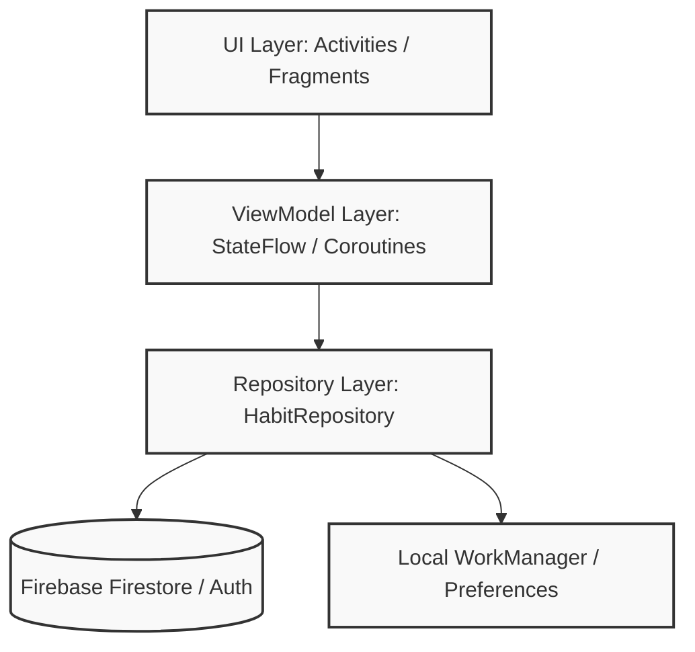

# Habitus


## Descripción del Proyecto

**Habitus** es una aplicación nativa para Android diseñada para la formación y seguimiento de hábitos positivos. Resuelve el problema de la falta de constancia mediante un sistema de progreso visual (rachas, historial y estadísticas) impulsado por una experiencia de usuario fluida y libre de distracciones.

Su valor principal radica en su enfoque centrado en la privacidad y rendimiento, sincronizando datos de forma segura en la nube mientras mantiene una arquitectura escalable y moderna que cumple con estándares profesionales de la industria.

## Stack Tecnológico

El proyecto está construido sobre las herramientas más modernas del ecosistema Android:

- **Lenguaje**: Kotlin 2.0.21
- **Construcción**: Android Gradle Plugin (AGP) 8.7.3
- **Inyección de Dependencias**: Dagger Hilt 2.51.1 (procesado vía KSP)
- **Backend as a Service (BaaS)**: Firebase Auth (Autenticación) y Firestore (Base de datos NoSQL)
- **Tareas en Segundo Plano**: WorkManager (Notificaciones y sincronización asíncrona)
- **Procesamiento de Anotaciones**: KSP (Kotlin Symbol Processing) para tiempos de compilación óptimos
- **Integración y Entrega Continua**: GitHub Actions (**[audit.yml]**(.github/workflows/audit.yml) y **[release.yml]**(.github/workflows/release.yml))

## Arquitectura

La aplicación implementa un patrón **Model-View-ViewModel** robusto, apoyado por el patrón Repository y la inyección de dependencias con Hilt para garantizar desacoplamiento y alta testabilidad.



### Responsabilidades por Capa:
- **UI Layer**: Responsable únicamente de renderizar estados (`UiState`) y capturar eventos del usuario. Usa ViewBinding.
- **ViewModel Layer**: Orquesta la lógica de presentación. Expone flujos reactivos (`StateFlow`) que sobreviven a rotaciones y aisla a la vista de los datos crudos.
- **Repository Layer**: Centraliza las operaciones de datos, aplicando reglas de negocio y transacciones atómicas con la nube.

## Características Principales

- **Gestión de Cuentas**: Registro seguro y login persistente vía Firebase Auth.
- **Seguimiento Dinámico**: Listado de hábitos semanales con soporte interactivo.
- **Sistema de Rachas**: Contabilidad inteligente de completaciones continuas con soporte para "días de gracia".
- **Modo Enfoque**: Pantalla inmersiva para tareas de alta concentración sin notificaciones molestas.
- **Notificaciones Locales**: Recordatorios y resúmenes de rendimiento procesados silenciosamente con `WorkManager`.
- **Archivado Histórico**: Oculta hábitos antiguos sin perder estadísticas pasadas.
- **Resumen Semanal**: Consolidado automático de completaciones, rachas mejoradas y puntos de mejora.

## Configuración Local

Para ejecutar HabitusApp en tu entorno local, sigue estos pasos de manera precisa:

1. **Clonar el repositorio**:
   ```bash
   git clone https://github.com/Ochoa-Stack/Habitus.git
   cd Habitus
   ```

2. **Añadir la configuración de Firebase**:
   Descarga tu archivo `google-services.json` desde Firebase Console y ubícalo en el directorio `app/`:
   ```text
   HabitTrackerApp/app/google-services.json
   ```
   > **Nota:** Este archivo está excluido en el `.gitignore` por seguridad.

3. **Sincronizar Gradle**:
   Abre el proyecto en Android Studio (Hedgehog o superior) y sincroniza las dependencias.

4. **Compilar y Ejecutar**:
   Asegúrate de tener un emulador activo o un dispositivo conectado y ejecuta:
   ```bash
   ./gradlew clean assembleDebug
   ```

## Integración y Entrega Continua mediante CI/CD

Habitus posee un pipeline automatizado vía **GitHub Actions** que asegura calidad y facilita la distribución:

- **`audit.yml`**: Se dispara en cada Push/PR a `develop` o `main`. Ejecuta validaciones de formato (`ktlint`), análisis estático avanzado (`detekt`), tests unitarios y compila un APK de Debug.
- **`release.yml`**: Se dispara al generar un nuevo `Tag`. Compila la aplicación, la firma criptográficamente usando secretos almacenados en GitHub, y adjunta el APK de producción en un nuevo release público de GitHub (Distribución gratuita sin Play Store).

## Autor

Desarrollado y mantenido por:
>**Elias Ochoa** - [GitHub](https://github.com/Ochoa-Stack) | [LinkedIn](https://www.linkedin.com/in/el%C3%ADas-ochoa-2934b0407/)\
> Repositorio Original: [GitHub](https://github.com/DjRober/HabitTrackerApp)

## Licencia

Este proyecto se distribuye bajo la licencia **MIT**. Siéntete libre de usarlo y modificarlo. Consulta el archivo [LICENSE](LICENSE) para más detalles.
